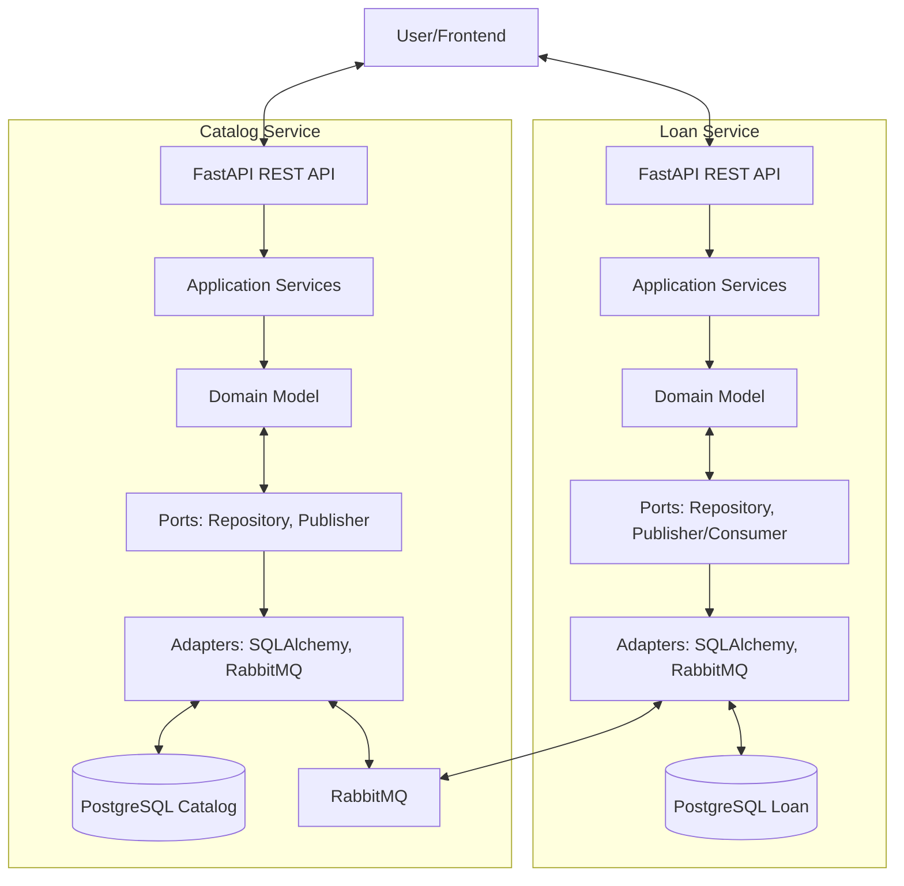

# LibraryHub — Library Loan System

## Installation

LibraryHub is a reference example for Kiln. To create a new LibraryHub project:

### Prerequisites

- **Windows**: PowerShell 7+, Git
- **Unix/macOS**: Bash/zsh, Git
- Claude Code CLI (to run agents in the swarm)

### Setup

Run the install script **from the Kiln repository root**:

**Windows (PowerShell):**
```powershell
.\bin\kiln-init.ps1 -Target C:\path\to\my-library-hub -Example library-hub
cd C:\path\to\my-library-hub
```

**Unix/macOS (Bash):**
```bash
./bin/kiln-init.sh /path/to/my-library-hub --example library-hub
cd /path/to/my-library-hub
```

### What the Script Creates

The install script scaffolds a complete, ready-to-run Kiln project with:
- **Constitution files** — `kiln/constitution/` with framework rules (engineering.md, workflow.md) and project-specific configuration
- **Agent role prompts** — `kiln/roles/` with specifier, coder, refactorer, architect instructions
- **Project configuration** — `kiln/profiles.yaml` defining the 4-agent swarm topology
- **Git repository** — Initialized on `main` branch with all files committed
- **Claude Code permissions** — `.claude/settings.json` pre-configured for agents
- **This brief** — `README.md` with architecture and user stories for agents to implement

### Launch the Swarm

Navigate back to the **Kiln repository root** and launch with the project as the working directory:

**Windows:**
```powershell
cd C:\path\to\kiln
.\bin\kiln.ps1 -WorkingDir C:\path\to\my-library-hub
```

**Unix/macOS:**
```bash
cd /path/to/kiln
./bin/kiln.sh /path/to/my-library-hub
```

Kiln will:
1. Create git worktrees for each agent (coder, refactorer, architect; specifier works on main)
2. Initialize tmux sessions or terminal windows/tabs
3. Generate and inject `CLAUDE.md` with full constitution + role + project context into each agent's environment
4. Launch the multi-agent collaboration

---

## Overview

LibraryHub is a simple but realistic digital library system where users can search for books, borrow them, and return them over a deadline. The system uses two independent microservices communicating via asynchronous messaging to maintain eventual consistency and decouple concerns.

This project serves as the **reference example for SwarmForge** — demonstrating a realistic use case with full TDD discipline, clean architecture, and multi-agent collaboration across specifier, coder, refactorer, and architect roles.

## Bounded Contexts

### Catalog Service
Owns the book catalog and stock management. Manages all book metadata (title, author, genre, description) and the current available count per ISBN. Publishes events when books are reserved or out of stock. Consumes book-return events to replenish stock and keep availability current. Database: PostgreSQL (books, book_stock tables).

### Loan Service
Owns user accounts and loan records with deadlines and overdue tracking. When a user requests to borrow, immediately returns PENDING and publishes a request event; consumes reservation results (ACTIVE/REJECTED) asynchronously. Manages loan lifecycle: PENDING → ACTIVE/REJECTED → RETURNED. Tracks due dates (default 28 days, configurable) and overdue items. Database: PostgreSQL (users, loans tables).

## User Stories

### Catalog Service
- **CAT-1**: Search books by title, author, or genre with pagination
- **CAT-2**: Check book availability by ISBN
- **CAT-3**: Create new book with metadata and initial stock
- **CAT-4**: Automatically increase stock when BookReturned event arrives
- **CAT-5**: Retrieve single book by ISBN
- **CAT-6**: Manual stock return endpoint

### Loan Service
- **LOAN-0**: Create user account to borrow books
- **LOAN-1**: Borrow book (immediate 202 Accepted response)
- **LOAN-2**: View single loan status
- **LOAN-3**: View all loans for a user
- **LOAN-4**: Return book
- **LOAN-5**: View overdue loans (admin)

## Architecture



The two services communicate via asynchronous messaging (event-driven), enabling eventual consistency and full decoupling.

## Out of Scope (MVP)

- User authentication and JWT
- Email/SMS notifications
- Payment system
- Complex user management or role-based access
- Frontend / UI
- Book cover images or advanced metadata

---

## Architecture & Layering Rules

### 3-Layer Structure

The codebase is organized into three layers with unidirectional dependencies (always flowing from outside to inside):

1. **Infrastructure** (outermost, knows everything)
   - FastAPI REST API, SQLAlchemy ORM, RabbitMQ adapters, Pydantic schemas
   - Responsibility: HTTP bindings, database adapters, message queue handlers, dependency injection
   - Location: `infrastructure/` package

2. **Application** (middle, orchestrates domain via ports)
   - Use cases, application services
   - Knows `domain/`, uses `domain/ports/`, does NOT import from `infrastructure/`
   - Location: `application/` package

3. **Domain** (innermost, pure business logic)
   - Entities, Value Objects, Domain Events, Port Interfaces (ABCs)
   - Zero dependencies on `application/` or `infrastructure/`
   - Location: `domain/` package

### Dependency Rules (Enforced)

| From | To | Allowed? |
| ---- | -- | -------- |
| `infrastructure/` | `application/` | Yes |
| `infrastructure/` | `domain/` | Yes |
| `application/` | `domain/` | Yes |
| `application/` | `infrastructure/` | No (only via ports) |
| `domain/` | `application/` | No |
| `domain/` | `infrastructure/` | No |

Violations detected by static analysis tools (mypy) or code review must be fixed before merge.

### Mapping Pattern

- **HTTP Request** (Pydantic DTO) → mapped by `infrastructure/api/` → **Domain Object** → **Use Case**
- **Domain Object** → mapped by `infrastructure/db/` → **ORM Model** → **Database**
- **Database** → **ORM Model** → mapped by `infrastructure/db/` → **Domain Object** → returned via API

Domain classes are **pure Python dataclasses** with no ORM (SQLAlchemy) or schema (Pydantic) imports.

### Package Structure (Per Service)

Flat layout — no `src/` wrapper. Each service is a Python package at the project root:

```text
<service>/                           (Python package, e.g. catalog/ or loan/)
├── __init__.py
├── domain/
│   ├── <entity>.py                  (pure dataclasses, business logic)
│   ├── events.py                    (domain events as dataclasses)
│   └── ports.py                     (ABC interfaces, no implementation)
├── application/
│   └── <use_case>.py                (orchestrates domain, calls ports)
└── infrastructure/
    ├── api/
    │   ├── main.py                  (FastAPI app)
    │   ├── schemas.py               (Pydantic DTOs)
    │   └── routers/                 (FastAPI endpoints)
    ├── db/
    │   ├── models.py                (SQLAlchemy ORM models)
    │   └── <x>_repository.py        (port implementations)
    ├── messaging/
    │   ├── publisher.py             (RabbitMQ publisher adapter)
    │   └── consumer.py              (RabbitMQ consumer adapter)
    └── config/
        └── settings.py              (pydantic-settings)
```

Gherkin feature files live at the project root in `features/` (not inside a service directory).

---

## Tech Stack (Locked Decisions)

- **Language**: Python 3.10+ with async/await patterns
- **REST Framework**: FastAPI (async, modern)
- **ORM**: SQLAlchemy 2.0+ (async driver: asyncpg for PostgreSQL)
- **Data Validation**: Pydantic v2 (schemas, DTOs, settings)
- **Database**: PostgreSQL (two isolated databases: catalog_db, loan_db)
- **Message Queue**: RabbitMQ (async, event-driven, Topic exchange pattern)
- **Testing**: pytest with async support (`pytest-asyncio`)
- **BDD / Acceptance Tests**: `pytest-bdd` — feature files in `features/`, step implementations in `tests/acceptance/steps/`
- **Acceptance Fixtures**: Testcontainers (`testcontainers[postgres,rabbitmq]`) — use real PostgreSQL and RabbitMQ; do NOT use in-memory SQLite for acceptance tests
- **Quality Tools**: `mutmut` (mutation testing), `mypy` (strict type checking), `ruff` (linting + formatting), `radon` (complexity/CRAP)
- **Package Manager**: `uv`

All services use the same tech stack. No divergence.

---

## Quality Gates

All gates are checked before handoff. Do not send a handoff if any gate fails.

- **Mutation Testing**: `domain/` and `application/` must achieve mutation score ≥ 80% — `mutmut run --paths domain,application`
- **Test Coverage**: All code must achieve > 90% — `coverage run -m pytest && coverage report`
- **Type Checking**: All code must pass `mypy` in strict mode, no `type: ignore` without explanation — `mypy catalog/ loan/ --strict`
- **Code Style**: Must pass `ruff` and `black` — `ruff check . && black --check .`

---

## Testing Strategy

**Unit Tests** (`tests/unit/`): pure business logic in isolation, mock all dependencies, no I/O, run fast. Coverage > 90%, mutation score ≥ 80%.

**Acceptance Tests** (`tests/acceptance/`): pytest-bdd step implementations that execute the `.feature` files in `features/`. Each step file must call `scenarios("features/<file>.feature")` so pytest treats the Gherkin scenarios as live test cases — without this the `.feature` files are dead documentation. Use Testcontainers for real PostgreSQL and RabbitMQ — do not use in-memory SQLite here.

**Test Organization**:

```text
tests/
├── conftest.py
├── unit/
│   ├── catalog/
│   │   ├── domain/         (unit tests for catalog domain)
│   │   └── application/    (unit tests for catalog application services)
│   └── loan/
│       ├── domain/
│       └── application/
└── acceptance/
    ├── conftest.py          (Testcontainers session fixtures)
    └── steps/
        ├── catalog_steps.py (step defs for features/cat-*.feature)
        └── loan_steps.py    (step defs for features/loan-*.feature)
features/                    (Gherkin specs — owned by specifier, do not modify)
```

| Command | Purpose |
| ------- | ------- |
| `pytest` | All tests — run before handoff |
| `pytest tests/unit/` | Unit tests only — quick feedback |
| `pytest tests/acceptance/` | Acceptance tests (requires running containers) |
| `pytest --cov=catalog --cov=loan` | Coverage report |
| `mutmut run --paths-to-mutate catalog/domain,catalog/application,loan/domain,loan/application` | Mutation testing |

---

## Non-Functional Requirements

- **Code language**: English only — comments, docstrings, variable names, error messages. Test data may contain Unicode.
- **Error handling**: Return appropriate HTTP status codes (404 not found, 409 conflict, 422 validation, 500 server error).
- **Logging**: Structured JSON logging in the infrastructure layer using standard library `logging`.
- **Authentication**: Not required for MVP.
